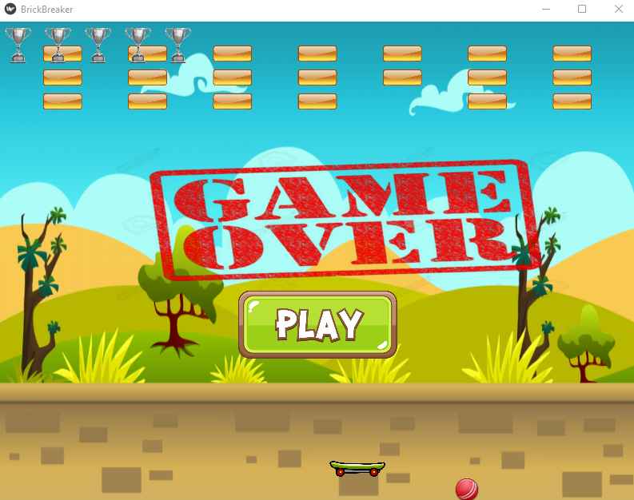

# Game Name

Welcome to our game! This README file provides information on installing, running, and playing the game.

## Table of Contents

1. [Overview](#Overview)
2. [Installation](#Installation)
3. [Running](#Running)
4. [Gameplay](#Gameplay)
5. [Contribution](#Contribution)
6. [License](#License)

## Overview

**Game Name** is an exciting and entertaining game that... (brief description of the game). The aim of the game is to...

## Installation

Follow these steps to install the game:

1. Make sure Python 3.10.11 is installed on your machine.
2. Clone the project from the GitHub repo:
   ```bash
   git clone https://github.com/username/game_repo.git
   ```
3. Navigate to the project directory:
   ```bash
   cd game_repo
   ```
4. Install the required packages:
   ```bash
   pip install -r requirements.txt
   ```

## Running

To start the game, run the following command from the project directory:
```bash
python main.py
```

## Gameplay

The aim of the game is to... (detailed description of the gameplay, rules, and objectives).

- **Navigation:** (e.g., Use the arrow keys to move your character)
- **Scoring:** (e.g., Each collected item is worth 10 points)
- **Dangers:** (e.g., Avoid enemies, or you will lose a life)

## Contribution

If you'd like to contribute to the development of the game, please follow these steps:

1. Fork the repo on GitHub.
2. Create a new branch for your features or fixes:
   ```bash
   git checkout -b new-feature-improve
   ```
3. Commit your changes:
   ```bash
   git commit -m "Add new feature"
   ```
4. Push the branch:
   ```bash
   git push origin new-feature-improve
   ```
5. Create a Pull Request in the main repo, and wait for the review.

## Screenshots

Here are some screenshots of the game:



## License

This project is licensed under the MIT License. For more information, please read the `LICENSE` file.

---

Enjoy the game, and don't hesitate to send feedback!