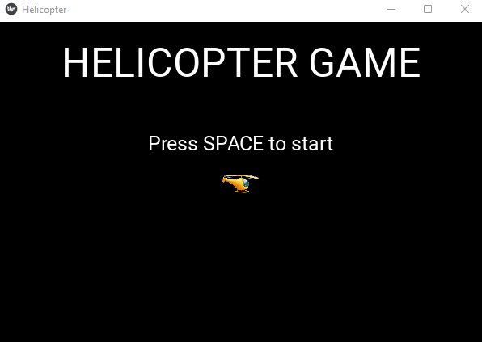

# Helicopter Game

This is a simple Helicopter Game built using Kivy Framework in Python.

## Requirements

- Python 3.6 or higher
- Kivy 2.0.0 or higher
- Pillow 8.1.0 or higher

## Installation

1. Clone the repository
```sh
    git clone https://github.com/mozo190/pycharmProjects/tree/master/pythonProject-Brick_Breaker_game.git
    cd helicopter-game
```
2. Create a virtual environment
```sh
    python -m venv venv
    venv\Scripts\activate
```

3. Install the requirements
```sh
    pip install -r requirements.txt
```

4. Run the game
```sh
    python main.py
```

## Game Controls

- SPACE: Start the game / Restart the game after "Game Over"
- UP Arrow: Move the helicopter up
- DOWN Arrow: Move the helicopter down

## Project Structure

- `main.py`: Main file to run the game
- `helicopterGame/`: Contains all the game files
    - `helicopter.kv`: Contains the Kivy Language file for the game
    - `helicopter.py`: Contains the main game logic
    - `background.png`: Background image for the game
    - `helicopter.png`: Helicopter image for the game
    - `obstacle.png`: Obstacle image for the game
    - `gameover.png`: Game Over image for the game
    - `scoreboard.png`: Scoreboard image for the game
    - `scoreboard.txt`: File to store the highest score

## Screenshots



## Contributing

1. Fork the repository
2. Create a new branch (`git checkout -b feature`)
3. Commit your changes (`git commit -am 'Add new feature'`)
4. Push to the branch (`git push origin feature`)
5. Create a new Pull Request

## License

This project is licensed under the MIT License - see the [LICENSE](LICENSE) file for details.
