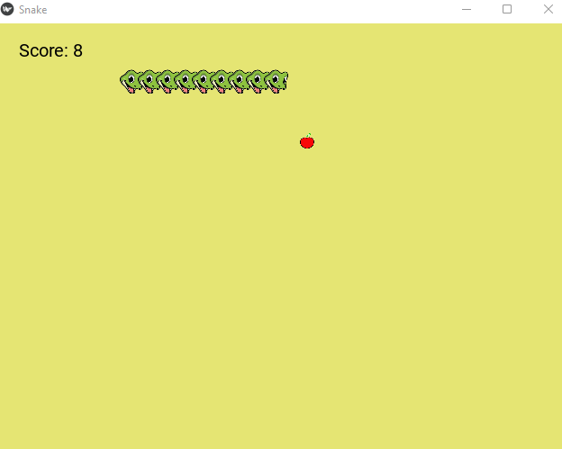

# Snake Game

This is a simple snake game built using the Kivy framework in Python.

## Requirements

- Python 3.6 or higher
- Kivy 2.0.0 or higher

## Installation

1. Clone the repository
2. Install the required packages using the following command:
```bash
pip install -r requirements.txt
```

## Usage

Run the following command to start the game:
```bash
python main.py
```

## Controls

- Use the arrow keys to move the snake
- Press `R` to restart the game
- Space: Pause/Resume the game

## Screenshots



## License

This project is licensed under the MIT License - see the [LICENSE](LICENSE) file for details.

