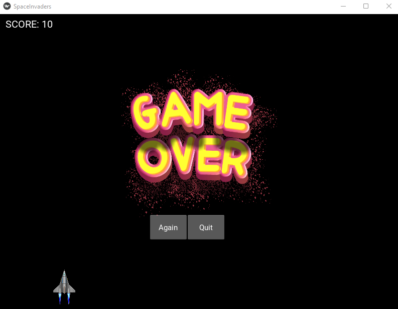

# Space Invader Game

This is a simple space invader game made using Kivy framework in Python.

## Features

- Player can move the spaceship left and right using arrow keys.
- Player can shoot bullets using the spacebar.
- Enemy aliens move from right to left and back.
- Player can destroy enemy aliens by shooting bullets at them.
- Player can score points by destroying enemy aliens.

## Requirements

- Python 3.x
- Kivy library
- Kivy installation: `pip install kivy`

## Installation

1. Clone the repository:

```bash
git clone
```

2. Install the Kivy library:

```bash
pip install kivy
```

3. Run the program:

```bash
python main.py
```

## Usage

- Run the program using the command above.
- Use the arrow keys to move the spaceship left and right.
- Use the spacebar to shoot bullets at the enemy aliens.

## Functionality

- The program initializes a Kivy window with a black background.
- A spaceship is drawn at the bottom of the window, and enemy aliens are created at random positions.
- Enemy aliens move from right to left and back, changing direction when they reach the window boundaries.
- Player can move the spaceship left and right using arrow keys.
- Player can shoot bullets using the spacebar.
- Bullets move upwards and destroy enemy aliens on collision.
- Enemy aliens are destroyed when hit by bullets, and player scores points.
- The game ends when an enemy alien reaches the spaceship or all enemy aliens are destroyed.
- Player can restart the game by pressing the 'R' key.
- Player can exit the game by pressing the 'Q' key.
- Player can view the score at the top of the window.
- Background music and sound effects enhance the gaming experience.

## Screenshots



## License

This project is licensed under the MIT License - see the [LICENSE](LICENSE) file for details.


